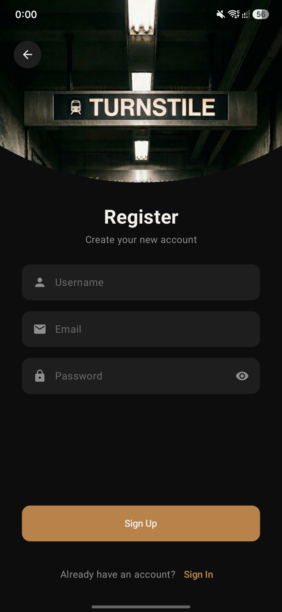
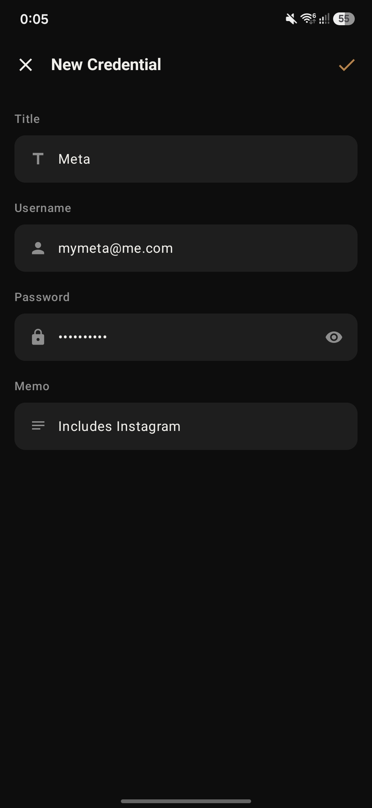

# 🔐 Turnstile
**Turnstile** is a KMP/CMP password manager Android & iOS application. Built with **Compose Multiplatform**, **Kotlin Multiplatform**, and **Clean Architecture**, the app enables users to register, sign in, and manage credentials in a personal vault. It leverages Firebase for authentication and Firestore for cloud storage.

The primary goal of Turnstile is **not the app itself** — it is a living architecture reference codebase. Every decision is deliberate and codified, producing a `CLAUDE.md` that can bootstrap future KMP projects with consistent, enforceable conventions.

---

## ✨ Features

- 🔐 **Authentication**
    - Email/password sign up and sign in
    - Session persistence across cold starts
    - Compensating transaction on sign up (rollback Firebase Auth if Firestore user creation fails)

- 🏠 **Vault**
    - List, create, edit, and delete credentials
    - Flow-based real-time updates from Firestore
    - Scoped to authenticated user

- 💡 **Splash**
    - Resolves session status on cold start
    - Routes to auth or vault accordingly

---

## 🖼️ Showcase

        

---

## 🧱 Tech Stack

### 🧩 Architecture
- Clean Architecture (Data, Domain, Presentation layers)
- MVI with MVIKotlin (StoreFactory, Executor, Reducer pattern)
- UseCase-driven domain interaction
- Konsist for structural architecture enforcement

### 🛠 Libraries
- [Compose Multiplatform](https://www.jetbrains.com/lp/compose-multiplatform/) — shared UI for Android and iOS
- [Kotlin Multiplatform](https://kotlinlang.org/docs/multiplatform.html)
- [MVIKotlin](https://arkivanov.github.io/MVIKotlin/) — MVI framework
- [Koin](https://insert-koin.io/) — dependency injection
- [Firebase Auth + Firestore](https://firebase.google.com/) via [GitLive KMP SDK](https://github.com/GitLiveApp/firebase-kotlin-sdk)
- [Compose Navigation](https://developer.android.com/develop/ui/compose/navigation) with type-safe destinations
- [Konsist](https://docs.konsist.lemonappdev.com/) — architecture test enforcement
- [ktlint](https://pinterest.github.io/ktlint/) + [ktlint-compose-rules](https://mrmans0n.github.io/compose-rules/)

---

## 📁 Project Structure

```
shared/
├── common/                          # Cross-cutting domain concepts
│   ├── auth/                        # Auth-related shared logic
│   ├── session/                     # Session resolution and persistence
│   └── user/                        # User creation and identity
├── feature/
│   ├── login/                       # Sign in, sign up, forgot password (collapsed)
│   ├── vault/                       # Credential CRUD
│   │   ├── data/
│   │   │   ├── datasource/
│   │   │   │   └── remote/
│   │   │   │       ├── dto/
│   │   │   │       │   └── CredentialDto.kt
│   │   │   │       ├── mapper/
│   │   │   │       │   └── CredentialMapper.kt
│   │   │   │       ├── CredentialRemoteDataSource.kt
│   │   │   │       └── CredentialRemoteDataSourceImpl.kt
│   │   │   └── repository/
│   │   │       └── CredentialRepositoryImpl.kt
│   │   ├── di/
│   │   │   └── VaultModule.kt
│   │   ├── domain/
│   │   │   ├── model/
│   │   │   │   └── Credential.kt
│   │   │   ├── repository/
│   │   │   │   └── CredentialRepository.kt
│   │   │   ├── usecase/
│   │   │   │   ├── DeleteCredentialUseCase.kt
│   │   │   │   ├── GetCredentialsUseCase.kt
│   │   │   │   ├── GetCredentialUseCase.kt
│   │   │   │   ├── SaveCredentialUseCase.kt
│   │   │   │   └── SignOutUseCase.kt
│   │   │   └── validation/          # CredentialValidation object (WIP)
│   │   └── presentation/
│   │       ├── navigation/
│   │       │   ├── VaultDestination.kt
│   │       │   └── VaultNavGraph.kt
│   │       └── screen/
│   │           ├── detail/          # Contract, Route, Screen, StoreFactory, ViewModel
│   │           ├── editor/          # Contract, Route, Screen, StoreFactory, ViewModel
│   │           └── list/
│   │               ├── component/   # Screen-private composables
│   │               ├── CredentialListContract.kt
│   │               ├── CredentialListRoute.kt
│   │               ├── CredentialListScreen.kt
│   │               ├── CredentialListSkeleton.kt
│   │               ├── CredentialListStoreFactory.kt
│   │               └── CredentialListViewModel.kt
│   └── splash/                      # Session resolution routing (collapsed)
├── infra/
│   ├── App.kt
│   ├── Platform.kt
│   ├── design/
│   │   ├── component/               # App-wide reusable composables
│   │   └── theme/                   # Design tokens, color palettes, spacing
│   ├── di/                          # Root Koin module wiring
│   ├── navigation/                  # Root nav graph
│   ├── network/                     # Network configuration
│   └── ui/                          # Shared UI utilities (AppError, InitialLoad, etc.)
konsist/                             # Dedicated module for architecture enforcement tests
```

---

## 🏛 Architecture Decisions

### Package structure
Three top-level packages under `shared/`:
- `infra/` — technical infrastructure (design system, platform utilities). No domain knowledge, no feature knowledge.
- `common/` — cross-cutting domain concepts shared across features. Follows `common/conceptName/layer/` convention.
- `feature/` — vertical feature slices. Each feature owns its full `data/domain/presentation/` stack.

### Data layer conventions
- `*DataSource` — single concept, single technology, pure CRUD. Interface is a domain contract.
- `*Repository` — orchestrates multiple DataSources. Owns cross-source logic and compensating transactions.
- `*UseCase` — orchestrates multiple repositories or hosts storage-agnostic business logic.
- `*Dto` — data class, no default values, blank fields normalize to null at write boundary.
- `*Entity` — local DB representation.
- Remote DataSources return only `Dto` or `Unit`. Local DataSources return `Entity`, primitives, or `Unit`.

### Domain layer conventions
- Plain data classes for domain models. No suffix.
- `*UseCase` suffix, `operator fun invoke()` entry point.
- `*Repository` suffix for repository interfaces.
- `*Validation` object for pure validation logic, lives in `feature/domain/validation/`.
- Validation functions return typed sealed interfaces (`EmailError`, `PasswordError`, etc.), not `StringResource`.

### Presentation layer conventions
Screen folders contain exactly these file types:
- **Stateless screen**: `Route.kt` + `Screen.kt`
- **Stateful screen**: `Contract.kt`, `Route.kt`, `Screen.kt`, `StoreFactory.kt`, `ViewModel.kt`
- **Stateful + loading**: same as above + `Skeleton.kt`

`Contract.kt` contains: `*Intent`, `*Label`, `*Action`, `*Message` (all sealed interfaces), `*State` (data class), optional `*Ui` sub-models (data classes), and mapper extension functions.

`Route.kt` — owns ViewModel injection, label collection, and delegates to Screen. Single public `@Composable` function. Parameters: lambdas, `Modifier`, and `*ViewModel` only.

`Screen.kt` — pure UI, no ViewModel. Single public `@Composable` function. Parameters: `*State`, lambdas, and `Modifier` only. State parameter has no default value.

`ViewModel.kt` — extends `ViewModel()`, single constructor parameter `*StoreFactory`, exposes `state: StateFlow<*State>`, `labels: Flow<*Label>`, and `fun onIntent()`.

`StoreFactory.kt` — MVIKotlin store wiring. Only file allowed to import from domain alongside ViewModel and Contract.

### MVI conventions
- `*Intent` — user-initiated events from the UI
- `*Label` — one-shot side effects (navigation, toasts)
- `*Action` — bootstrapper-initiated internal triggers
- `*Message` — reducer input, produced by executor
- `*State` — immutable state snapshot

Label collection happens in `Route.kt` via `LaunchedEffect`. Subscribe before dispatching intent to avoid timing issues on synchronous executors.

### Dependency injection (Koin)
- `factoryOf` for UseCases and StoreFactories
- `viewModelOf` for ViewModels
- `singleOf` for Repositories and DataSources
- `SavedStateHandle.toRoute<T>()` for runtime navigation parameters, not `parametersOf`

### Architecture enforcement (Konsist)
A dedicated `konsist/` module enforces all structural rules as unit tests. Rules cover bidirectional name↔location enforcement, type enforcement, dependency boundary violations, and public surface constraints across all three layers.

---

## 🧪 Running Tests

```bash
# Run architecture tests
./gradlew :konsist:test

# Run unit tests
./gradlew :shared:testDebugUnitTest
```

---

## 🚧 Possible Improvements

- Proper error handling — structured error taxonomy across layers with typed domain errors propagating cleanly to UI
- Improved typography — design token-based type scale with semantic text styles across the design system
- Improved field validations — richer validation rules (password strength, email format, length constraints) with real-time feedback
- Offline support — local caching with SQLDelight and a sync strategy for Firestore writes while offline
- iOS target polish — platform-specific UI adaptations and expect/actual refinements for a production-quality iOS experience
- Unit test coverage — UseCase and StoreFactory unit tests with MockK to validate business logic and MVI state transitions

---

## 🧑‍💻 Author

**Nicolas Zurbuchen**  
Android Software Engineer based in Tokyo, Japan  
Contact: [nicolas.zurbuchen@outlook.com](mailto:nicolas.zurbuchen@outlook.com)